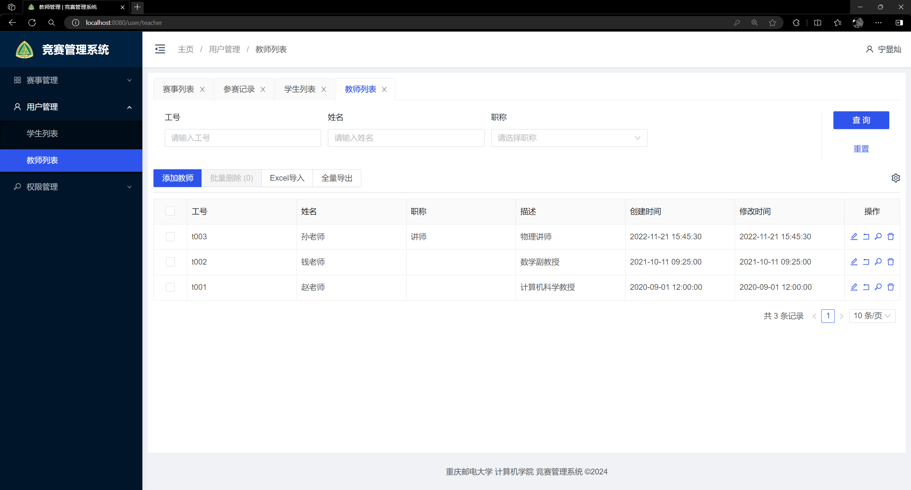

# 项目简介
## 背景
本项目于2024年五月构建 目的在于参加数据库大赛  
本项目的设计背景为不想要烂大街的项目（如学生管理系统、图书管理系统等）又想要创建一个不脱离大学生大学生活的系统。
## 项目主题
最终我们将选题瞄准了大学生竞赛系统既不那么常见又紧贴大学生的生活---竞赛管理系统
## 软件和语言选择
前端主要使用vscode基于vue和javascript构建 后端主要使用goland基于golang语言构建 数据库由Navicat基于myaql构造
## 调试和优化
由于本人水平有限在项目构建过程中借助了许多网上教程和ai帮助我快速调试bug和优化代码风格
主要调试软件edge浏览器来测试前端网页，postman 来测试后端请求

## 项目总结构
- **`competition_system/`**：前端系统
    - **`files/`**：客户端界面截图。
    - **`node_models/`**：本地初始化的项目依赖。
    - **`pubilc/`**：静态公用资源。
        - `favicon.ico`：网页标识。
        - `index.html`：加载&首屏动画。
        - `logo.png`：logo
    - **`src/`**：核心开发文件。
        - **`api/`**：路由文件。
            - `axios.js`：发起网络请求。
            - `index.js`：设置路由
        - **`assets/`**：网页设计优化。
        - `bg.svg`：网页设计优化。
        - **`components/`**：UI 组件
            - **`common/`**：常用组件。
                - `404.vue`：显示 404 页面。
                - `ColumnSetting.vue`：提供表格列设置功能。
                - `ContextMenu.vue`：右键点击时显示的上下文菜单。
                - `DisplayFailedUser.vue`：显示处理失败的用户数据。
                - `GrantRole.vue`：授予或分配角色权限。
                - `Loading.vue`：显示加载状态或等待状态。
                - `LoginState.vue`：显示当前用户的登录状态。
                - `UpdatePassword.vue`：允许用户修改账户密码。
                - `Upload.vue`：提供文件上传功能。
                - `UserImport.vue`：批量导入用户数据。
                - `UserLogin.vue`：用户登录界面。
            - **`edit/`**：编辑相关组件。
                - `edit-mixin.js`：表单状态管理和验证。
                - `EditPermission.vue`：编辑权限信息组件。
                - `EditRace.vue`：编辑比赛信息组件。
                - `EditRole.vue`：编辑角色信息组件。
                - `EditStudent.vue`：编辑学生信息组件。
                - `EditTeacher.vue`：编辑教师信息组件。
            - **`race/`**：比赛相关组件。
                - `Detail.vue`：比赛详情。
                - `RaceDetail.vue`：比赛详情页面。
            - **`record/`**：比赛记录相关组件。
                - `AddRecord.vue`：添加记录。
                - `AuditRecord.vue`：审核记录。
                - `RecordAction.vue`：记录操作。
                - `ShowRecordDetail.vue`：显示记录详情
            - **`transition/`**：过渡效果组件。
                - `PageToggleTransition.vue`：页面切换过渡效果。
            - `AntTable.vue`：Ant Design Vue 表格组件。
            - `Drawer.vue`：抽屉组件，用于显示可滑出隐藏的侧边栏。
        - **`helpers/`**：辅助工具。
            - `columns.js`：定义学生和教师的列配置，并根据类型返回对应配置。
        - **`layouts/`**：布局组件。
            - **`common/`**存放通用布局组件
                - `Header.vue`：页面头部组件。
                - `Sidebar.vue`：页面侧边栏组件。
            - `GlobalLayout.vue`：全局布局组件。
            - `TabLayout.vue`：带有标签页的布局组件。 
        - **`pages/`**：具体页面组件。
            - **`race/`**：比赛相关页面。
                - `Race.vue`：比赛页面。
                - `Record.vue`：比赛记录页面。
            - **`role/`**：角色相关页面。
                - `PermissionList.vue`：权限列表页面。
                - `RoleList.vue`：角色列表页面。
            - **`user/`**：用户相关页面。
                - `Student.vue`：学生信息页面。
                - `Teacher.vue`：教师信息页面。
            - `Login.vue`：登录页面。
        - **`plugins/`**：插件文件，扩展 Vue 功能。
            - `confirm.js`：确认对话框插件。
            - `drawer.js`：抽屉插件。
            - `form.js`：表单插件。
            - `index.js`：插件入口文件。
        - **`router/`**：路由配置。
            - `index.js`：定义应用的路由。
        - **`store/`**：状态管理。
            - `index.js`：Vuex 状态管理入口。
        - **`style/`**：样式文件。
            - `mixins.styl`：样式混入文件。
            - `reset.styl`：样式重置文件。
            - `variables.styl`：样式变量文件。
        - **`tool/`**：工具和表单组件。
            - **`form/`**：表单工具和组件。
                - `ConfigForm.vue`：配置表单组件。
                - `content.js`：表单内容配置。
                - `helpers.js`：表单辅助函数。
                - `index.js`：表单工具入口。
                - `label.js`：表单标签配置。
                - `README.md`：表单工具说明文档。
                - `SearchForm.vue`：搜索表单组件。
            - `DelPopConfirm.vue`：删除确认对话框。
            - `index.js`：工具入口文件。
        - **`utils/`**：实用工具。
            - `const.js`：常量定义。
            - `excel.js`：Excel 处理工具。
            - `qiniu.js`：七牛云文件上传工具。
        - `App.vue`：根组件。
        - `main.js`：入口文件。
        - `permission.js`：权限控制文件。
    - `.browserslistrc`：指定支持的浏览器版本。
    - `.editorconfig`：定义代码格式和风格。
    - `.eslintrc.js`：ESLint 配置文件。
    - `.gitignore`：指定不被 Git 版本控制的文件或目录。
    - `babel.config.js`：Babel 配置文件。
    - `jsconfig.json`：JavaScript 项目配置文件。
    - `package-lock.json`：记录当前安装的具体依赖版本树。
    - `package.json`：项目元数据和依赖项配置。
    - `README.md`：项目说明文档。
    - `vue.config.js`：Vue CLI 项目配置文件。
- **`competition_server/`**：后端支持
    - **`config/`**：配置文件和数据库初始化脚本。
        - `config.go`：初始化数据库并配置会话密钥。
        - `init_mysql`：数据库结构及其数据初始化
    - **`controllers/`**：处理各种功能业务逻辑的控制器。
        - `auth.go`：登录及其认证。
        - `permissions.go`：管理权限设置。
        - `races.go`：处理比赛相关功能。
        - `record.go`：管理比赛记录。
        - `role.go`：角色管理功能。
        - `users.go`：管理用户相关的功能。
    - **`middlewares/`**：包含处理请求的中间件。
        - `auth_check.go`：权限验证中间件。
        - `login_check.go`：登录验证中间件。
        - `user.go`：与用户操作相关的中间件。
    - **`models/`**：定义数据库的数据结构。
        - `json.go`：定义json返回需要的字段
        - `models.go`：定义数据库中使用的所有模型。
    - **`routes/`**：设置 API 端点。
        - `routes.go`：配置应用的所有路由。
    - **`utils/`**：应用的实用工具函数。
        - `db.go`：数据库实用工具函数。
        - `qiniu.go`：实现文件上传下载逻辑。
    - **`main.go`**：主函数。
    - **`go.mod`**：项目依赖项
## 项目功能
1. 竞赛信息管理功能，具有相应权限的用户可以向系统中添加竞赛信息；
2. 成绩录入功能，具有相应权限的用户可以查看或修改参赛记录信息，可修改录入系统中的成绩信息。
3. 用户管理功能：主要包括对学生和教师信息的管理。
4. 权限管理：包括对系统权限和系统角色的管理，以角色授权等操作，采用 RBAC(Role Based Access Control)策略，基于角色进行细致的权限控制。

其中竞赛信息，参赛信息和用户信息支持导出 Excel，且用户信息支持 Excel 导入，方便管理员管理系统信息。

系统主要工作在 RBAC 权限管理上，算是一个小小的亮点，其他诸如用户管理、竞赛管理均是简单的增删改查。虽有不完善的地方，但很适合作为一个起始项目，由你们添砖加瓦，作为毕设或者大作业等。

在技术选型上以 JavaScript & Node.js 为主要开发语言，前端使用 Vue.js 全家桶，后端主要使用 Node.js 与 TypeScript 实现，采用 Web 服务框架 Express 与 MySQL 数据库构建后台应用。

[后端项目地址](https://github.com/nxc2003/competition-server)

# 项目运行

启动项目进入首页，系统初始账号密码为`admin/123`，身份为学生。

> 如果改变后端地址(localhost:3000)，请修改`vue.config.js`中对应的代理配置。

# 功能模块图

# 系统截图

## 登录界面

## 赛事列表

## 参赛记录

## 学生列表

## 教师列表

## 用户导入

## 授权

## 角色列表

## 角色编辑

## 权限列表

## 编辑权限

